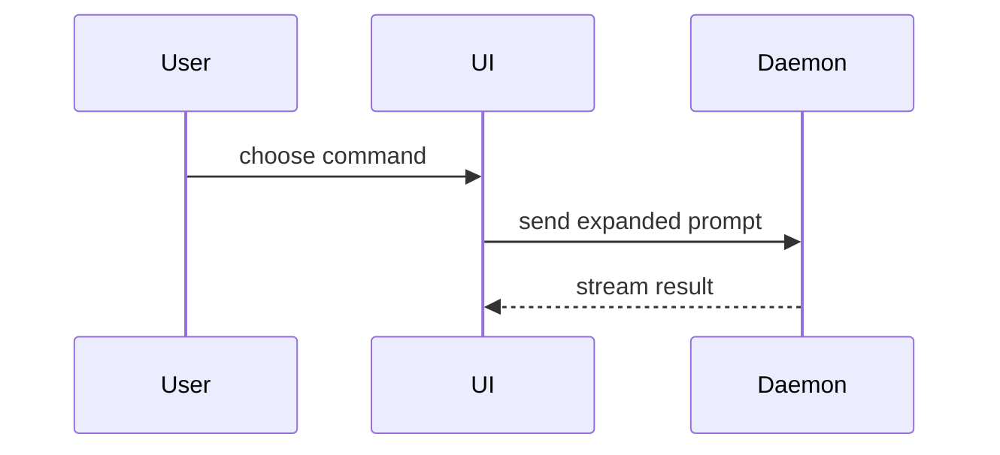

<!-- Generated by scripts/generate-platform-artifacts.cjs. Do not edit. -->

# Pull Request Workflow

## Response Rules

Reply in the user's language.

- **Simplicity** — one idea per sentence; the plain word over the impressive one.
- **Brevity** — answer first, then stop; no preamble, no restating the request, no summarizing what you just wrote.
- **Clarity** — lead with the outcome, then what changed and what it costs; label an unverified claim as unverified.
- **Humanity** — write as a colleague, not a system; familiar technical English over literal translation; no performative enthusiasm, no apology theater, no location stereotypes.
- **Terminology** — reach for the precise domain term and keep it in its English form; never respell it phonetically in the reply's script (`ผลเทสท์` for `test`) or translate it literally (`หูจับ` for `handle`). Gloss an unfamiliar term once — `CPA (ต้นทุนต่อการได้ลูกค้าหนึ่งราย)` — then anchor it with one concrete example.

Keep working without user input while the requested outcome remains inside current authority. Use a reversible smart default and record assumptions. Ask only when one material user-owned decision changes scope, risk, cost, or success, or when a required effect crosses an unapproved boundary.

Prepare a GitHub pull request for the current branch or reviewed local changes. Default mode is **prepare-only**: produce the PR body/checklist and safety report without staging, committing, pushing, or creating/updating a PR.

This skill is manual-only. Use it after review passes, or when the user explicitly asks
to prepare or open a pull request.

## PR body

Write this body during prepare-only and again when opening a PR after approval.
Skip preambles. Keep prose brief. Use the user's domain language from `CONTEXT.md`
when that file exists.

```markdown
## Summary

<diagram, diff-sketch, or tree>

## Evidence

- **Before:** <screenshot/output/failing test run>
  **After:** <screenshot/output/passing test run>

## Merge Danger

**Door:** <one-way or two-way>

<optional: description>

**Blast Radius:** <one-word description>

<optional: potential ramifications of merge>
```

### Summary

Pick the smallest view that makes the key point clear.

- Show logic or an algorithm as pseudocode:

```text
on(save)
  if content is unchanged
    return cached result
  write new content
  return fresh result
```

- Show runtime control flow as a call tree:

```text
submitForm
  createSession
    persistPrompt
    launchAgent
  navigateToSession
```

- Show UI structure as a component tree, including state and module boundaries
  that matter:

```tsx
<SessionPage>(apps / example / src / routes / session.tsx);
useSessionEvents() < SessionToolbar > <RunSkillButton>(packages / ui);
```

- Show file responsibility or a broad refactor as a shallow file tree:

```text
src/
├── commands/       # parses user actions
├── sessions/       # owns session state
└── transport/      # sends API requests
```

- Show component interaction, control flow, or data flow with Mermaid:



- Use `diff` when the point is what changes and the surrounding shape already
  exists. Match the diff shape to the topic.

For a component change:

```diff
 <SessionPage>
   useSessionEvents()
   <SessionToolbar>
+    <RunSkillButton />
   <SessionTimeline>
+    <SkillResultCard />
```

For a file-layout change:

```diff
 src/
 ├── commands/
+│   └── show-me.ts       # expands the slash command
 ├── sessions/
-└── transport.ts
+└── transport/
+    ├── client.ts
+    └── stream.ts
```

For a call-tree or call-stack change:

```diff
 submitForm
   createSession
     persistPrompt
+    expandSkillMention
     launchAgent
-  navigateToSession
+  navigateToSession
+    subscribeToEvents
```

For a state or control-flow change:

```diff
 on(save)
-  write content
+  if content is unchanged
+    return cached result
+  write new content
+  invalidate cache
```

- Show the whole block when most of it is new, when omitted context would hide
  ownership or order, or when the user needs a copyable target shape:

```ts
function expandSkill(command: string): string {
  const skillName = command.slice(1);
  return `use the ${skillName} skill`;
}
```

Place each visual next to the short text it supports. Keep only the calls, files,
props, states, and boundaries needed to answer the current question. You may use
one of these, you may use several, it is unlikely you will use all of them.

### Evidence

Concrete evidence that the change works. Show a before and after.

Screenshots are S-tier when the environment is set up for it and the change is
visual.

Execution-based evidence is A-tier. Test results, console output. Show the exact
test that now fails and passes, using pseudocode.

### Merge Danger

Describe whether it is a one-way or two-way door. You can walk back through
two-way doors, but not one-way doors. A PR that is cheap to roll back is lower
risk. Changes that involve destructive actions or hard-to-reverse decisions are
one-way doors.

The blast radius is the potential impact or scope of the changes introduced by
this PR. Consider all possibilities. Examples are layout shift, breakages for
consumers, mobile responsiveness.

## Workflow

1. **Prepare-only by default.** Inspect branch, remote, dirty/untracked files, diff,
   outgoing commits, review result, gates, and repository authentication. Resolve the
   exact GitHub repository from the selected remote URL and repository guidance. In a
   fork, never let a CLI infer the fork parent as the PR target: bind an explicit
   repository selector such as `GH_REPO=<owner/repo>` or `--repo <owner/repo>` to every
   GitHub read and write, then verify the returned repository. Produce a conventional
   title, the PR body template above, exact candidate paths, and safety findings.
   Do not stage or write locally/remotely in this mode.
2. **Resolve requested writes.** If the user asked to commit, push, open, or update a
   pull request, enumerate exact paths, commit message, outgoing commits, remote/ref,
   repository API operations, title/body digest, and force mode.
3. **Verify.** Secret-scan the exact proposed staged diff and run required gates.
   Missing auth or failed gates produces `BLOCKED`, not a reduced-safety workflow.
4. **Bind intent.** Canonicalize the proposed write object with stable key ordering and
   use its complete 64-character lowercase SHA-256 hex digest as `intent_digest`.
5. **Request approval.** Show the intent — target, paths, commits, commands — then ask
   through the host's structured choice prompt if one is available; otherwise present a
   numbered list. Label the approving option with the real target, such as
   `Push → origin/feat-x, open PR`; never label it only `Approve`. This gate is `confirm`:
   a click on that option or a plain affirmative both count. A question, a change request,
   an affirmative inside a quote or code block, and any answer given before the intent was
   shown do not. Without approval, return the envelope below and stop. Do not delegate a
   mutating step.
6. **Resume and revalidate.** Recompute branch state, file list, outgoing commits,
   title/body, commands, auth, and digest immediately before writing. Any drift invalidates
   the approval; show the new intent and ask again. One approval authorizes one intent and
   never carries to the next gate or to a retry after any change.
7. **Execute exact intent.** Delegate to an available PR worker or run sequentially.
   Pass the approved intent and token. Stage only listed paths, commit only if listed,
   push only the approved ref, then perform only listed API writes. After approval, write
   the same PR body template used in prepare-only.
8. **Verify outcome.** Report commit SHA, remote ref, pull-request URL, and CI state.
   CI repairs are a new change and require a new approval if they write or push.

## Approval Protocol

```json
{
  "schema": "spk.approval/v1",
  "status": "NEEDS_USER_INPUT",
  "operation": "pull_request_write",
  "approval_mode": "confirm",
  "intent_digest": "<64 lowercase hex>",
  "target": {"remote": "<remote>", "branch": "<branch>", "repository": "<owner/repo>"},
  "paths": ["<reviewed path>"],
  "commits": ["<outgoing or proposed commit>"],
  "commands": ["<exact git/API command and environment + argv, including GH_REPO=<owner/repo>>"],
  "choices": [{"label": "<target-naming approval label>", "approves": true}, {"label": "Cancel", "approves": false}],
  "resume_instruction": "Choose the approving option, or reply with a plain affirmative"
}
```

`intent_digest` stays in the envelope as the drift detector: recompute and compare it
before writing, not as something the user has to type.

## Autonomy Profile

`boundary_gated` — prompt budget 1; repair budget 2. Prepare and verify the exact boundary intent without mutation, then request one approval for the declared operation. After approval, complete every stage and allowed retry inside the stable envelope without another prompt. Before pausing, persist the approved envelope digest, current phase, evidence, attempts, and rollback or recovery path.

## Evidence Receipt

Return `spk.evidence/v1` with mode, approval digest, paths, commit/ref, pull-request URL,
commands and gate results, deliberately unstaged files, risks, and next action.

## Guardrails

- Prepare-only never stages, commits, pushes, or calls a write API.
- Never use `git add .`; stage only the approved explicit path list.
- Never force-push unless the bound intent says `--force-with-lease`.
- Never merge, deploy, or modify unrelated files.
- Never expose credentials or include raw private sources.
- Never push from dirty `main` without listing every outgoing commit.

## Credits

PR body template is a selective port of mattpocock/skills `skills/in-progress/pr`
at `c55ee46073ed923f86ce59a5eb3b6d895095d1b7` (2026-09-18). That skill credits
Dex Horthy and HumanLayer `show-me`
(https://github.com/humanlayer/skills/blob/main/plugins/show-me/skills/show-me/SKILL.md).
This is not a wholesale merge of upstream `in-progress`. Prepare-only, approval,
secret-scan, and dirty-main rules in this file stay in force.
