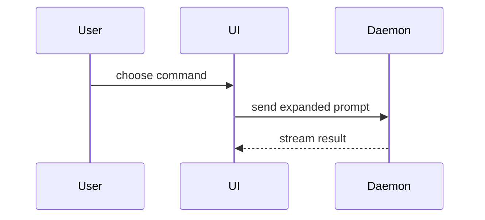

# pr

Skill นี้เป็น manual-only โหมด default คือ **prepare-only**: สร้าง PR body และ safety report โดยไม่ stage, commit, push หรือสร้าง PR

## รวบรวม Context

- ถ้าอยู่ใน git worktree ให้รัน `git status --short --branch --untracked-files=all`
- ถ้าอยู่ใน git worktree ให้รัน `git remote get-url origin` และ `git rev-list --left-right --count HEAD...origin/main`; ถ้า remote/main ไม่มี ให้บันทึกว่าไม่มีข้อมูลเปรียบเทียบ
- ถ้าอยู่ใน git worktree ให้รัน `git log --oneline --decorate -8` และ `git diff --stat`; ถ้าไม่ใช่ git repo ให้รายงานว่า PR context ไม่พร้อมแทนการหยุดด้วย error
- เช็ค `gh auth status`

## PR body

เขียน body นี้ตอน prepare-only และตอนเปิด PR หลังอนุมัติ ตัด preamble ทิ้ง ใช้ภาษาโดเมนจาก `CONTEXT.md` ถ้ามี

```markdown
## Summary

<diagram, diff-sketch, or tree>

## Evidence

- **Before:** <screenshot/output/failing test run>
  **After:** <screenshot/output/passing test run>

## Merge Danger

**Door:** <one-way or two-way>

<optional: description>

**Blast Radius:** <one-word description>

<optional: potential ramifications of merge>
```

### Summary

เลือกภาพที่เล็กที่สุดที่ทำให้จุดหลักชัด

- logic หรือ algorithm ใช้ pseudocode:

```text
on(save)
  if content is unchanged
    return cached result
  write new content
  return fresh result
```

- runtime control flow ใช้ call tree:

```text
submitForm
  createSession
    persistPrompt
    launchAgent
  navigateToSession
```

- โครง UI ใช้ component tree รวม state และขอบเขตโมดูลที่สำคัญ:

```tsx
<SessionPage>(apps / example / src / routes / session.tsx);
useSessionEvents() < SessionToolbar > <RunSkillButton>(packages / ui);
```

- ความรับผิดชอบของไฟล์หรือ refactor กว้างใช้ shallow file tree:

```text
src/
├── commands/       # parses user actions
├── sessions/       # owns session state
└── transport/      # sends API requests
```

- interaction, control flow หรือ data flow ใช้ Mermaid:



- ใช้ `diff` เมื่อประเด็นคือสิ่งที่เปลี่ยน และโครงรอบข้างมีอยู่แล้ว ให้รูป `diff` ตรงกับหัวข้อ

component:

```diff
 <SessionPage>
   useSessionEvents()
   <SessionToolbar>
+    <RunSkillButton />
   <SessionTimeline>
+    <SkillResultCard />
```

file-layout:

```diff
 src/
 ├── commands/
+│   └── show-me.ts       # expands the slash command
 ├── sessions/
-└── transport.ts
+└── transport/
+    ├── client.ts
+    └── stream.ts
```

call-tree:

```diff
 submitForm
   createSession
     persistPrompt
+    expandSkillMention
     launchAgent
-  navigateToSession
+  navigateToSession
+    subscribeToEvents
```

state หรือ control-flow:

```diff
 on(save)
-  write content
+  if content is unchanged
+    return cached result
+  write new content
+  invalidate cache
```

- โชว์ทั้งบล็อกเมื่อของใหม่เป็นส่วนใหญ่ เมื่อตัดบริบทแล้วซ่อน ownership/ลำดับ หรือเมื่อผู้ใช้ต้องได้รูปที่ copy ได้

```ts
function expandSkill(command: string): string {
  const skillName = command.slice(1);
  return `use the ${skillName} skill`;
}
```

วางภาพไว้ข้างข้อความสั้นที่มันรองรับ เก็บเฉพาะ call, ไฟล์, prop, state และขอบเขตที่ตอบคำถามรอบนี้ ใช้อันเดียวก็ได้ หลายอันก็ได้ ไม่ต้องใช้ครบ

### Evidence

หลักฐานที่จับต้องได้ว่าของใหม่ทำงาน โชว์ before และ after

screenshot เป็น S-tier เมื่อ environment พร้อมและงานเป็นเรื่องภาพ

หลักฐานจากการรันเป็น A-tier เช่นผล test, console output โชว์ test ที่ fail แล้ว pass ด้วย pseudocode

### Merge Danger

บอกว่าเป็น one-way หรือ two-way door เดินกลับสองทางได้ เดินกลับทางเดียวไม่ได้ PR ที่ rollback ถูกมีความเสี่ยงต่ำกว่า งานทำลายของหรือตัดสินใจที่ย้อนยากเป็น one-way door

Blast Radius คือผลกระทบหรือขอบเขตที่ PR นี้อาจแตะ ดูให้ครบ ตัวอย่างเช่น layout shift, พังฝั่ง consumer, mobile responsiveness

## Workflow

1. **Prepare-only เป็น default** ตรวจ branch, remote, dirty/untracked files, diff, outgoing commits, review, gates และ auth ระบุ GitHub repository จาก selected remote URL และคำสั่งของ repo ให้ชัดเจน ใน fork ห้ามปล่อยให้ CLI infer fork parent เป็น PR target ให้ bind explicit repository selector เช่น `GH_REPO=<owner/repo>` หรือ `--repo <owner/repo>` กับทุก GitHub read/write แล้วตรวจ repository ที่ตอบกลับมา จากนั้นสร้าง title และ PR body ตามเทมเพลตด้านบน พร้อม exact paths และ safety findings โดยห้าม local/remote write
2. **Resolve writes** ถ้า user ขอ commit/push/open/update ให้ list exact paths, commit message, outgoing commits, remote/ref, API operations, title/body digest และ force mode
3. **Verify** secret-scan proposed staged diff ที่แน่นอนและรัน gates ถ้า auth หายหรือ gate fail ให้ `BLOCKED`
4. **Bind intent** canonicalize proposed write object แบบ stable key ordering แล้วใช้ SHA-256 lowercase hex ครบ 64 ตัว
5. **ขอ approval** แสดง intent — target, paths, commits, commands — แล้วถามผ่าน structured choice prompt ของ host ถ้ามี ถ้าไม่มีให้ใช้ numbered list ตั้ง label ของตัวเลือกที่อนุมัติด้วย target จริง เช่น `Push → origin/feat-x, open PR` ห้าม label ว่า `Approve` เฉย ๆ gate นี้เป็น `confirm` กดตัวเลือกนั้นหรือตอบรับธรรมดาก็นับทั้งคู่ แต่คำถาม การขอแก้ คำตอบรับที่อยู่ใน quote หรือ code block และคำตอบที่มาก่อนแสดง intent ไม่นับ ถ้ายังไม่อนุมัติให้คืน envelope และหยุด ห้าม delegate mutating step
6. **Resume + revalidate** คำนวณ state/digest ใหม่ก่อน write ทุกครั้ง drift ใด ๆ ล้ม approval ให้แสดง intent ใหม่แล้วถามอีกรอบ หนึ่ง approval คุมหนึ่ง intent ไม่ยกไป gate ถัดไปหรือ retry หลังมีอะไรเปลี่ยน
7. **Execute exact intent** ส่ง approved intent + token ให้ PR worker หรือทำ sequential stage เฉพาะ paths ที่ list, commit/push/API write เฉพาะที่อนุมัติ หลังอนุมัติให้เขียน PR body ชุดเดียวกับตอน prepare-only
8. **Verify outcome** รายงาน commit SHA, remote ref, PR URL และ CI state การแก้ CI ที่ write/push ต้อง approval ใหม่

## Approval Protocol

```json
{
  "schema": "spk.approval/v1",
  "status": "NEEDS_USER_INPUT",
  "operation": "pull_request_write",
  "approval_mode": "confirm",
  "intent_digest": "<64 lowercase hex>",
  "target": {"remote": "<remote>", "branch": "<branch>", "repository": "<owner/repo>"},
  "paths": ["<reviewed path>"],
  "commits": ["<outgoing หรือ proposed commit>"],
  "commands": ["<exact git/API command + environment + argv รวม GH_REPO=<owner/repo>>"],
  "choices": [{"label": "<label ที่ระบุ target จริง>", "approves": true}, {"label": "ยกเลิก", "approves": false}],
  "resume_instruction": "Choose the approving option, or reply with a plain affirmative"
}
```

`intent_digest` ยังอยู่ใน envelope ในฐานะตัวจับ drift คำนวณใหม่แล้วเทียบก่อน write ไม่ใช่สิ่งที่ user ต้องพิมพ์

## Autonomy Profile

`boundary_gated` — เตรียม intent ให้ครบแล้วขออนุมัติ boundary เพียงครั้งเดียว prompt budget 1, repair budget 2 รอบ ก่อนหยุดต้องบันทึก phase, assumption, evidence, attempts และ next action ที่ทำต่อได้

## Evidence Receipt

คืน `spk.evidence/v1` ที่มี mode, approval digest, paths, commit/ref, PR URL, commands/gates, files ที่ตั้งใจไม่ stage, risks และ next action

## Safety Rules

- Default เป็น prepare-only: อย่า stage, commit, push หรือ create/update PR เว้นแต่ถูกขออย่างชัดเจน
- อย่า force-push เว้นแต่ถูกสั่งและใช้ `--force-with-lease`
- ห้าม network/local write จนกว่า approval จะผ่าน revalidation ของ state ปัจจุบัน
- อย่า push จาก dirty `main` โดยไม่ระบุ commit ทั้งหมดที่จะออกไป
- Stage เฉพาะ paths ที่ review แล้ว อย่า `git add .` เมื่อมี untracked/generated/operator files
- Secret-scan staged diff ก่อน commit
- ถ้า GitHub auth ไม่มี ให้เตรียม PR body ไว้ที่เครื่องแล้วรายงาน setup steps

## Credits

เทมเพลต PR body เป็นการ port เฉพาะส่วนจาก mattpocock/skills `skills/in-progress/pr`
ที่ `c55ee46073ed923f86ce59a5eb3b6d895095d1b7` (2026-09-18) skill นั้นเครดิต Dex Horthy
และ HumanLayer `show-me`
(https://github.com/humanlayer/skills/blob/main/plugins/show-me/skills/show-me/SKILL.md)
นี่ไม่ใช่การ merge upstream `in-progress` ทั้งก้อน กติกา prepare-only, approval,
secret-scan และ dirty-main ในไฟล์นี้ยังใช้ตามเดิม
